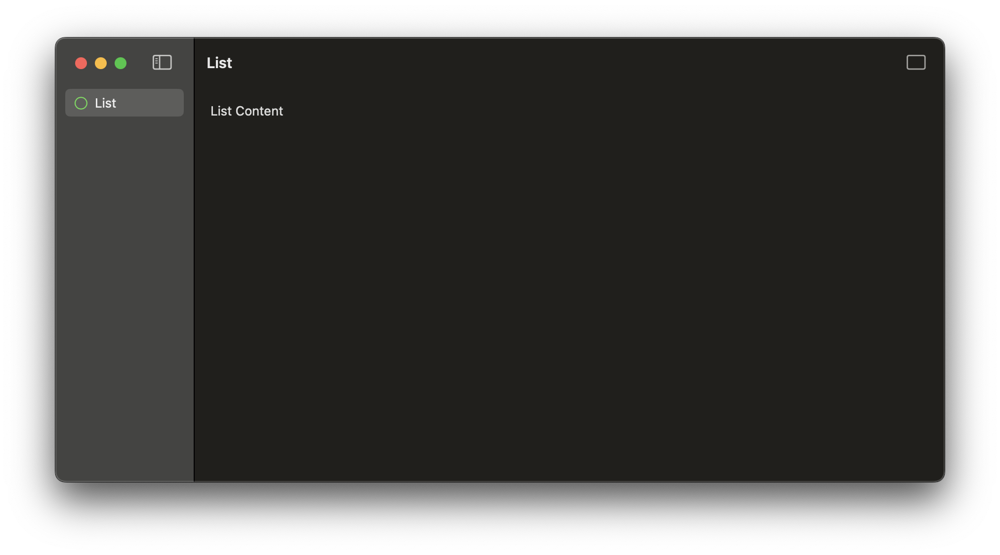
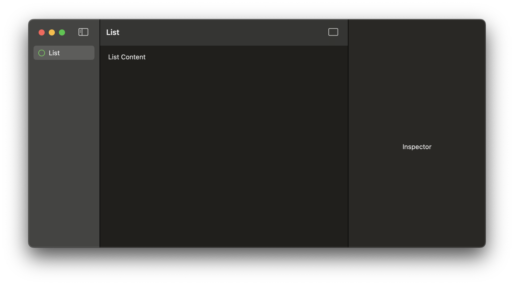
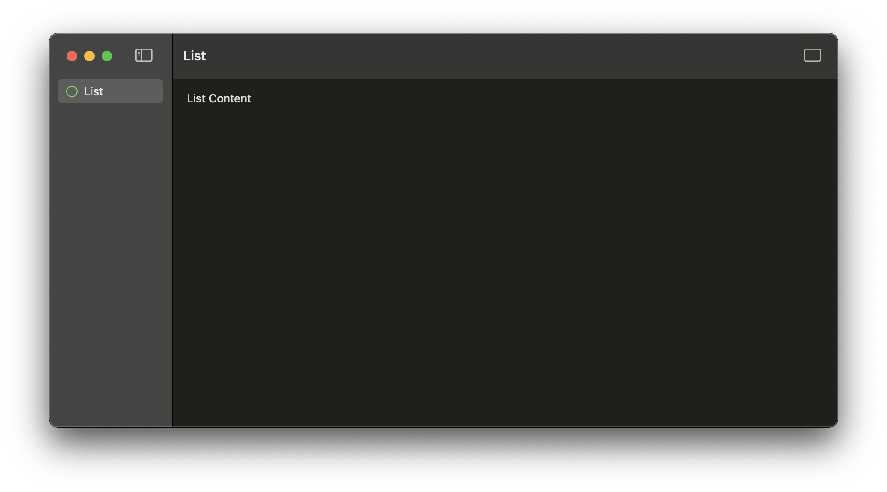

#  FB13323306 - SwiftUI macOS: Inspector attached to SplitView removes scroll edge behaviour on List

## Scenario

An app has a SplitView with sidebar and List as content. The app can show an inspector. 
The List does not show the windowBar when not scrolled.

## The Issue

When the inspector is displayed the scroll edge behaviour of the List changes and the windowBar appears.
When the inspector disappears, the windowBar stays visible.

## Example Code

The example contains a SplitView with a List and an Inspector that can be opened by a toolbar button. 
On start the windowBar above the list is not visible. When the inspector is opened, the windowBar appears and stays visible even when the inspector is closed again.

## Tested on 

- macOS  14.0
- iPadOS 17.0
